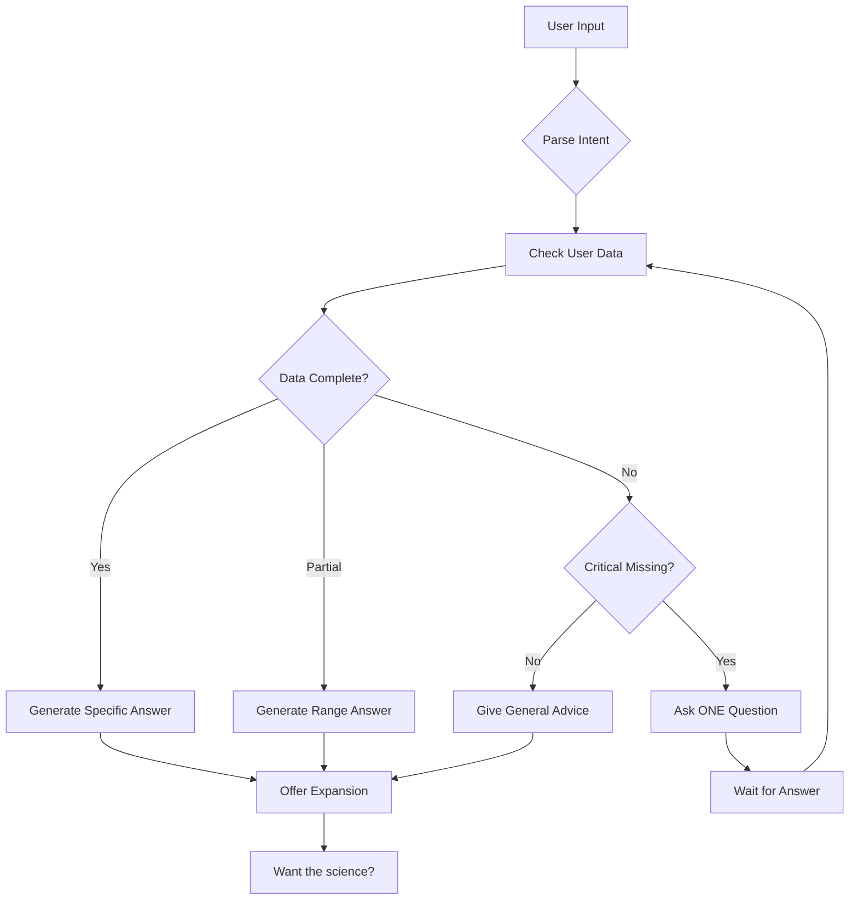

# 🧠 FeelSharper AI Training Methodology
*The Complete Guide to Training Context-Aware, Adaptive AI Coaching*

*Last Updated: 2025-08-21*
*Status: Core training philosophy and implementation guide*

## 🎯 Mission Statement
Train the AI to act like a **sharp, adaptive, context-aware coach** — not a generic chatbot.

---

## 1. 🌟 Core Philosophy

### Fundamental Principles
- **Never overwhelm** the user with information
- **Answer with what's known** from actual data
- **Ask only ONE clarifying question** when critical data is missing
- **Adapt advice** to user's profile, logs, and confidence level
- **Base recommendations on evidence + personalization**, not opinion

### User Experience Goals
- Fast for casual users (quick answers)
- Deep for power users (science available on request)
- Personal feeling (like the AI knows them)
- Trustworthy (transparent about confidence)

---

## 2. 📚 Training Layers

### 🔹 Layer 1: Structured Data Awareness

**Always Check:**
```javascript
const dataCheckPriority = {
  1: "User profile (goals, diet, restrictions, sport)",
  2: "Recent logs (last 7 days of activity)",
  3: "Confidence score for each data point",
  4: "Patterns from historical data",
  5: "Context from current conversation"
};
```

**Decision Tree:**
- Data complete → Give specific recommendation
- Data partial → Give range-based advice
- Data missing → Ask ONE key question OR give safe general advice

### 🔹 Layer 2: Knowledge Base Architecture

**Evidence Sources:**
- **Sports Nutrition**: ISSN (International Society of Sports Nutrition)
- **Exercise Science**: ACSM (American College of Sports Medicine)
- **General Health**: WHO, CDC, major consensus guidelines
- **Recovery Science**: Peer-reviewed meta-analyses
- **Performance**: Sport-specific governing bodies

**Structured Playbooks:**
```yaml
pre_event_fueling:
  24h_before: "Normal meals, extra hydration, moderate carbs"
  3-4h_before: "Full meal: carbs + moderate protein + low fat"
  2h_before: "Light snack: mostly carbs, minimal fat/fiber"
  1h_before: "Liquid or very light carbs only"
  30min_before: "Water only, maybe sports drink"
  
post_workout_recovery:
  0-30min: "Protein + carbs (3:1 ratio carbs:protein)"
  30-60min: "Full meal if hungry, continue hydration"
  2-3h: "Normal meal, ensure protein target met"
  
sleep_deprivation:
  <5h_training: "Reduce intensity to 70% or switch to recovery"
  <5h_competition: "Maintain plan, expect reduced performance"
  5-6h: "Normal workout, monitor fatigue closely"
```

**Citation Protocol:**
- AI always references which playbook/evidence it's using
- Builds trust through transparency
- Example: "Based on ISSN guidelines for pre-competition nutrition..."

### 🔹 Layer 3: Personalization Rules

**Constraint Filters:**
```javascript
const userConstraints = {
  dietary: {
    vegan: "No animal products in recommendations",
    vegetarian: "No meat, fish allowed",
    glutenFree: "Avoid wheat, barley, rye",
    lactoseIntolerant: "No dairy products",
    keto: "Keep carbs <50g/day",
    paleo: "No grains, dairy, processed foods"
  },
  goals: {
    weightLoss: "Emphasize deficit gently, sustainable approach",
    performance: "Prioritize fueling even if calories increase",
    muscle: "Focus on protein timing and total intake",
    endurance: "Carb availability is critical",
    health: "Balance and moderation over optimization"
  },
  medical: {
    diabetes: "Consider glycemic impact",
    hypertension: "Limit sodium recommendations",
    ibs: "Suggest low-FODMAP options"
  }
};
```

**Adaptive Tone Matrix:**
| Data Quality | Response Style | Example |
|-------------|---------------|---------|
| High Confidence | Precise numbers | "Eat 30g protein within 30 minutes" |
| Medium Confidence | Ranges | "Aim for 25-35g protein soon after" |
| Low Confidence | Directional | "Prioritize protein after your workout" |
| No Data | Safe defaults | "Generally, protein helps recovery" |

### 🔹 Layer 4: Interaction Protocol

**Conversation Flow:**


**Response Structure:**
1. **Direct Answer** (1-2 sentences)
2. **Action Items** (bullet points)
3. **Optional Expansion** ("Want to know why?")
4. **Confidence Indicator** (when uncertain)

### 🔹 Layer 5: Continuous Learning System

**Data Collection:**
```javascript
const learningMetrics = {
  interactions: {
    questionAsked: boolean,
    questionAnswered: boolean,
    adviceFollowed: boolean,
    userSatisfaction: 1-5
  },
  corrections: {
    parsingErrors: [], // User corrected AI interpretation
    adviceRejections: [], // User explicitly disagreed
    clarifications: [] // User provided more context
  },
  patterns: {
    commonQuestions: Map<string, count>,
    successfulAdvice: Map<scenario, outcome>,
    failurePoints: Map<scenario, reason>
  }
};
```

**Feedback Loop:**
- Weekly: Review parsing errors → improve NLP
- Biweekly: Analyze ignored advice → refine recommendations
- Monthly: Pattern analysis → update playbooks
- Quarterly: Full model retraining with accumulated data

---

## 3. 📊 Training Data Sources

### Primary Sources (Curated)
1. **Expert Consultation**
   - 2 Sports Dietitians (RD, CSSD)
   - 1 Strength & Conditioning Coach (CSCS)
   - 1 Sports Medicine Physician
   - 1 Sport Psychologist

2. **Literature Database**
   - PubMed systematic reviews (last 5 years)
   - Cochrane Reviews (exercise & nutrition)
   - Position stands from major organizations
   - Sport-specific guidelines

3. **Real User Data** (anonymized)
   - Beta user logs (n=100+)
   - Successful patterns from power users
   - Common questions and scenarios
   - Edge cases and failures

### Synthetic Training Data
```python
# Generate 10,000+ training scenarios
scenarios = [
    {
        "context": "Tennis player, match in 2h, ate 3h ago",
        "input": "What should I eat?",
        "output": "Light carb snack: banana, energy bar, or toast",
        "confidence": "high"
    },
    {
        "context": "Runner, marathon tomorrow, vegan",
        "input": "Dinner recommendations?",
        "output": "Pasta with marinara, quinoa bowl, or rice with beans. Extra carbs tonight.",
        "confidence": "high"
    },
    # ... thousands more
]
```

---

## 4. 🚀 Implementation Roadmap

### Phase 1: MVP AI Parsing (Week 1)
- [x] Train GPT-4 to parse free text → structured JSON
- [x] Handle food, exercise, sleep, mood, weight
- [x] Achieve 95% accuracy on common inputs
- [ ] Build correction mechanism for errors

### Phase 2: Rule Engine v1 (Week 2)
- [ ] Codify top 35 scenarios (including safety):
  - Pre-workout fueling (5 variations)
  - Post-workout recovery (3 variations)
  - Sleep issues (3 variations)
  - Weight plateaus (2 variations)
  - Hydration (2 variations)
  - Protein optimization (3 variations)
  - Travel/dining out (2 variations)
  - **SAFETY: Medical red flags (Rule #21)**
  - **SAFETY: Chronic conditions (Rule #22)**
  - **SAFETY: Medication interactions (Rule #23)**
  - **SAFETY: Injury detection (Rule #24)**
  - **SAFETY: Overtraining detection (Rule #31)**
  - Portion estimation (Rule #26)
  - Micronutrient monitoring (Rule #27)
  - Special diets (Rule #28)
  - Competition nutrition (Rule #30)
  - Motivation adaptation (Rule #34)
  - Privacy & trust (Rule #35)

### Phase 3: Question Protocol (Week 3)
- [ ] Implement question importance ranking
- [ ] Train AI to ask only #1 priority question
- [ ] Build question → answer → response flow
- [ ] Test with 50 scenarios

### Phase 4: Knowledge Expansion (Week 4)
- [ ] Add sport-specific modules:
  - Tennis (complete)
  - Running (endurance)
  - Weightlifting (strength)
  - CrossFit (mixed)
  - Cycling (endurance)
- [ ] Add dietary modules:
  - Standard omnivore
  - Vegetarian/Vegan
  - Keto/Low-carb
  - Mediterranean
  - Intermittent fasting

### Phase 5: Feedback Loop (Month 2)
- [ ] Implement interaction tracking
- [ ] Build correction interface
- [ ] Create learning pipeline
- [ ] Set up retraining schedule

### Phase 6: Advanced Personalization (Month 3)
- [ ] Pattern recognition from user history
- [ ] Predictive recommendations
- [ ] Automated insight generation
- [ ] Performance correlation analysis

---

## 5. 📝 Training Examples

### Example 1: Complete Data Available
```yaml
Input: "I have a match in 2h. What should I eat?"
Context:
  - Last meal: 5h ago (lunch - chicken and rice)
  - User type: Tennis player
  - Typical pre-match: Banana + energy bar
  - Dietary: No restrictions

AI Process:
1. Check logs ✓ (5h since meal)
2. Apply playbook (2h pre-event)
3. Check patterns (user's typical works)
4. Skip question (have all data)

Response: "Since it's been 5h since lunch, have something light but substantial: your usual banana + energy bar combo, or try toast with honey. You've had good results with this before matches."

Confidence: HIGH
```

### Example 2: Missing Critical Data
```yaml
Input: "I'm sore from yesterday. Should I train?"
Context:
  - Last workout: Unknown
  - User type: Not specified
  - Sleep: Unknown
  - Next event: Unknown

AI Process:
1. Check logs ✗ (missing workout data)
2. Critical question needed
3. Rank questions by importance
4. Ask #1 only

Response: "Let me help you decide."
Question: "Is this normal muscle soreness or pain that limits movement?"

If "normal": "Light activity helps DOMS. Try 20min easy cardio or yoga."
If "pain": "Skip training today. Rest, ice, and reassess tomorrow."

Confidence: MEDIUM (after answer)
```

### Example 3: Conflicting Constraints
```yaml
Input: "Need protein but traveling, only McDonald's"
Context:
  - User type: Strength athlete
  - Goals: Muscle gain
  - Dietary: Trying to eat clean
  - Current: Traveling

AI Process:
1. Recognize constraint conflict
2. Prioritize immediate need (protein)
3. Acknowledge preference (clean eating)
4. Provide practical solution

Response: "Not ideal, but protein is priority. Get 2 grilled chicken sandwiches (no mayo) or grilled chicken salad with extra chicken. About 50g protein, reasonably clean given the situation."

Confidence: HIGH
```

---

## 6. ✅ Success Criteria

### Quantitative Metrics
- **Parse Accuracy**: >95% for common inputs
- **Response Time**: <2 seconds
- **Question Rate**: <20% of interactions
- **Follow-through**: >70% implement advice
- **Satisfaction**: >4.5/5 average rating

### Qualitative Indicators
- ✅ Users say: "It feels like it knows me"
- ✅ Advice feels personal, not generic
- ✅ Questions are rare but always relevant
- ✅ Recommendations respect constraints
- ✅ Trust builds over time

### Red Flags (Avoid These)
- ❌ Generic responses ("eat healthy, exercise more")
- ❌ Information overload (walls of text)
- ❌ Multiple questions in one interaction
- ❌ Ignoring user constraints
- ❌ Inconsistent advice session-to-session

---

## 7. 🔧 Technical Implementation

### AI Model Architecture
```python
class FeelSharperAI:
    def __init__(self):
        self.parser = GPT4Parser()
        self.knowledge_base = KnowledgeBase()
        self.rule_engine = RuleEngine()
        self.personalization = PersonalizationLayer()
        self.confidence_calculator = ConfidenceCalculator()
    
    def process_input(self, user_input, user_context):
        # 1. Parse intent and entities
        parsed = self.parser.parse(user_input)
        
        # 2. Calculate confidence
        confidence = self.confidence_calculator.assess(
            parsed, user_context
        )
        
        # 3. Apply rules
        base_response = self.rule_engine.apply(
            parsed, user_context, confidence
        )
        
        # 4. Personalize
        final_response = self.personalization.adapt(
            base_response, user_context
        )
        
        # 5. Format for delivery
        return self.format_response(final_response, confidence)
```

### Confidence Calculation
```python
def calculate_confidence(data_points, recency, relevance):
    """
    High: >4 relevant data points, <24h old
    Medium: 2-4 data points OR <7 days old
    Low: <2 data points OR >7 days old
    """
    score = 0
    
    # Data completeness (0-5 points)
    score += min(data_points, 5)
    
    # Recency (0-3 points)
    if recency < 24: score += 3
    elif recency < 72: score += 2
    elif recency < 168: score += 1
    
    # Relevance (0-2 points)
    score += relevance * 2
    
    if score >= 8: return "high"
    elif score >= 4: return "medium"
    else: return "low"
```

---

## 8. 🎓 Training Best Practices

### DO's
- ✅ Start with high-frequency scenarios
- ✅ Use real user language in training data
- ✅ Include edge cases and errors
- ✅ Version control all playbooks
- ✅ A/B test different response styles
- ✅ Document why each rule exists

### DON'Ts
- ❌ Over-engineer for rare scenarios initially
- ❌ Use medical diagnosis language
- ❌ Make promises about outcomes
- ❌ Ignore user feedback patterns
- ❌ Train on biased or limited datasets

---

## 9. 🔄 Continuous Improvement

### Weekly Reviews
- Parsing errors and corrections
- Most asked clarifying questions
- User satisfaction scores
- Response time metrics

### Monthly Updates
- Playbook refinements
- New scenario additions
- Pattern analysis results
- Model retraining if needed

### Quarterly Audits
- Full accuracy assessment
- Expert review of advice quality
- User journey analysis
- Competitive benchmarking

---

## 10. 🎯 North Star

The AI should feel like having a **knowledgeable friend** who:
- Knows your history and preferences
- Gives practical, actionable advice
- Respects your time (concise)
- Admits when unsure (honest)
- Learns what works for you (adaptive)
- Never judges or preaches (supportive)

**Success = Users trust the AI with their fitness journey**

---

*This document is the source of truth for AI training methodology. Update it as we learn.*