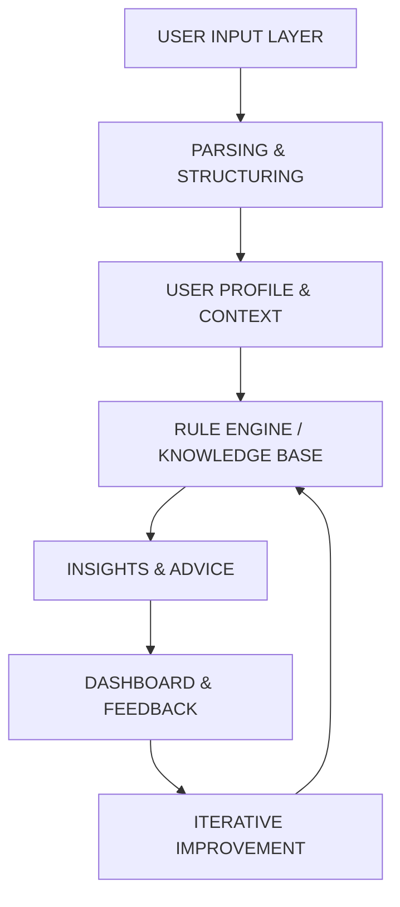

# 🏗️ FeelSharper System Architecture & Data Flow
*Complete end-to-end system design for intelligent fitness coaching*

*Last Updated: 2025-08-21*
*Status: Core system architecture specification*

## 🌊 Complete Data Flow Architecture



---

## 1️⃣ USER INPUT LAYER

### Input Channels & Processing

```typescript
interface InputChannels {
  textLog: {
    source: 'chat' | 'voice';
    raw: string;
    timestamp: Date;
    confidence: 'user_provided';
  };
  
  deviceSync: {
    source: 'garmin' | 'apple_watch' | 'whoop' | 'strava';
    data: DeviceData;
    confidence: 'device_verified';
  };
  
  manualEntry: {
    type: 'weight' | 'meals' | 'mood' | 'custom';
    value: any;
    confidence: 'user_confirmed';
  };
}
```

### 1.1 Text Log (Chat/Voice)
**Implementation:**
```typescript
class TextInputHandler {
  async processInput(input: string, isVoice: boolean): Promise<ProcessedInput> {
    // Voice transcription if needed
    if (isVoice) {
      input = await this.transcribeVoice(input);
    }
    
    // Natural language examples
    const examples = {
      nutrition: "Had eggs and toast for breakfast, coffee with milk",
      exercise: "Ran 5k in 25 minutes, felt great",
      weight: "Weight 175 this morning",
      mood: "Feeling tired but motivated",
      sleep: "Slept 7 hours, woke up twice",
      mixed: "175lbs, ran 3 miles, eggs for breakfast"
    };
    
    return {
      raw: input,
      timestamp: new Date(),
      source: isVoice ? 'voice' : 'chat',
      needsParsing: true
    };
  }
}
```

### 1.2 Device Sync Integration
**Supported Devices & Data:**
```yaml
Garmin Connect:
  - Activities: GPS, HR, pace, cadence, power
  - Daily: Steps, floors, intensity minutes
  - Health: Sleep stages, HRV, stress, body battery
  - Confidence: 100% (device-measured)

Apple Watch/Health:
  - Workouts: Type, duration, calories, HR
  - Activity: Rings, stand hours, exercise minutes
  - Health: Sleep, HRV, VO2max, walking steadiness
  - Confidence: 100% (device-measured)

Whoop:
  - Recovery: HRV, resting HR, respiratory rate
  - Strain: Daily strain, activity strain
  - Sleep: Stages, debt, efficiency
  - Confidence: 100% (device-measured)

Strava:
  - Activities: Distance, time, elevation, power
  - Social: Kudos, comments (motivation tracking)
  - Segments: Performance benchmarks
  - Confidence: 95% (user-uploaded)
```

### 1.3 Manual Entry Forms
**Fallback UI Components:**
```typescript
const ManualEntryForms = {
  weight: {
    fields: ['weight', 'unit', 'time_of_day'],
    validation: 'numeric_range',
    confidence: 90
  },
  meals: {
    fields: ['food_items', 'portion_size', 'meal_type'],
    quickSelect: ['common_meals'],
    confidence: 70
  },
  mood: {
    fields: ['energy_1_10', 'motivation_1_10', 'notes'],
    visualScale: true,
    confidence: 100
  },
  custom: {
    fields: ['metric_name', 'value', 'unit'],
    userDefined: true,
    confidence: 80
  }
};
```

---

## 2️⃣ PARSING & STRUCTURING LAYER

### NLP Pipeline Architecture

```typescript
class ParsingEngine {
  private gpt4: OpenAIClient;
  private confidenceCalculator: ConfidenceCalculator;
  
  async parse(input: ProcessedInput): Promise<StructuredData> {
    // Step 1: Intent Classification
    const intent = await this.classifyIntent(input.raw);
    
    // Step 2: Entity Extraction
    const entities = await this.extractEntities(input.raw, intent);
    
    // Step 3: Structured JSON Generation
    const structured = await this.generateJSON(intent, entities);
    
    // Step 4: Confidence Scoring
    const confidence = this.calculateConfidence(structured, input.source);
    
    // Step 5: Device Data Cross-Check
    const verified = await this.crossCheckDeviceData(structured);
    
    return {
      type: intent,
      data: verified || structured,
      confidence,
      originalText: input.raw,
      timestamp: input.timestamp
    };
  }
}
```

### 2.1 Parsing Categories & Patterns
```javascript
const ParsingPatterns = {
  food: {
    patterns: [
      /(?:ate|had|consumed)\s+(.+)/i,
      /breakfast|lunch|dinner|snack/i,
      /(\d+)\s*(?:grams?|g|oz|cups?)/i
    ],
    entities: ['food_items', 'quantities', 'meal_type', 'time'],
    confidence_factors: {
      specific_quantities: +20,
      brand_names: +15,
      vague_descriptions: -30
    }
  },
  
  workout: {
    patterns: [
      /(?:ran|cycled|swam|lifted)\s+(.+)/i,
      /(\d+)\s*(?:miles?|km|minutes?|hours?|reps?|sets?)/i,
      /(?:easy|moderate|hard|zone\s*\d)/i
    ],
    entities: ['activity_type', 'duration', 'distance', 'intensity', 'metrics'],
    confidence_factors: {
      device_sync_available: +40,
      specific_metrics: +25,
      subjective_only: -20
    }
  },
  
  sleep: {
    patterns: [
      /slept?\s+(\d+)\s*(?:hours?|hrs?)/i,
      /(?:woke|wake)\s+(?:up)?\s+(\d+)/i,
      /(?:quality|terrible|great|poor|good)\s+sleep/i
    ],
    entities: ['duration', 'wake_times', 'quality', 'bed_time', 'wake_time'],
    confidence_factors: {
      device_tracked: +50,
      specific_times: +20,
      duration_only: -10
    }
  },
  
  mood: {
    patterns: [
      /feeling\s+(\w+)/i,
      /(?:energy|motivation)\s+(?:is\s+)?(\d+)/i,
      /(?:stressed|anxious|happy|tired|energized)/i
    ],
    entities: ['energy_level', 'motivation', 'stress', 'overall_mood', 'notes'],
    confidence_factors: {
      numeric_scales: +30,
      multiple_dimensions: +20,
      single_word: -15
    }
  },
  
  weight: {
    patterns: [
      /(?:weight|weigh)\s+(\d+\.?\d*)\s*(?:lbs?|kg|pounds?|kilos?)?/i,
      /(\d+\.?\d*)\s*(?:lbs?|kg)/i
    ],
    entities: ['weight_value', 'unit', 'time_of_day'],
    confidence_factors: {
      morning_weight: +10,
      consistent_time: +15,
      unit_specified: +5
    }
  }
};
```

### 2.2 Confidence Score Calculation
```typescript
class ConfidenceCalculator {
  calculate(
    parsedData: any,
    source: string,
    deviceData?: any
  ): number {
    let score = 50; // Base score
    
    // Source confidence modifiers
    const sourceModifiers = {
      device_verified: 50,    // Device data is truth
      user_confirmed: 30,     // Manual entry with confirmation
      user_provided: 0,       // Text input baseline
      voice_transcribed: -5   // Potential transcription errors
    };
    
    score += sourceModifiers[source] || 0;
    
    // Data completeness modifiers
    if (parsedData.quantities?.length > 0) score += 15;
    if (parsedData.specific_times) score += 10;
    if (parsedData.brand_or_product) score += 10;
    if (parsedData.subjective_only) score -= 20;
    if (parsedData.vague_terms?.length > 0) score -= 15;
    
    // Device override
    if (deviceData && this.matchesActivity(parsedData, deviceData)) {
      return 95; // Device data takes precedence
    }
    
    return Math.min(100, Math.max(0, score));
  }
}
```

### 2.3 Cross-Check with Device Data
```typescript
async function crossCheckDeviceData(
  parsed: ParsedData,
  userId: string
): Promise<EnhancedData | null> {
  // Check for device data in similar timeframe
  const deviceWindow = 30 * 60 * 1000; // 30 minutes
  const deviceData = await getDeviceData(userId, parsed.timestamp, deviceWindow);
  
  if (!deviceData) return null;
  
  // Match activities
  if (parsed.type === 'workout' && deviceData.activities?.length > 0) {
    const match = findBestActivityMatch(parsed, deviceData.activities);
    if (match.confidence > 0.8) {
      return {
        ...parsed,
        data: merge(parsed.data, match.activity),
        confidence: 95,
        source: 'device_verified',
        deviceSource: match.device
      };
    }
  }
  
  // Match sleep
  if (parsed.type === 'sleep' && deviceData.sleep) {
    return {
      ...parsed,
      data: deviceData.sleep, // Device sleep data is more accurate
      confidence: 100,
      source: 'device_verified'
    };
  }
  
  return null;
}
```

---

## 3️⃣ USER PROFILE & CONTEXT LAYER

### Comprehensive User Model

```typescript
interface UserProfile {
  // Core Identity
  id: string;
  userType: 'endurance' | 'strength' | 'sport' | 'professional' | 'weight_mgmt';
  sport?: 'tennis' | 'running' | 'cycling' | 'triathlon' | 'gym' | 'mixed';
  
  // Goals (Hierarchical)
  goals: {
    primary: Goal;
    secondary: Goal[];
    constraints: string[]; // "no more than 5h/week", "must be sustainable"
  };
  
  // Dietary Profile
  dietary: {
    restrictions: ('vegan' | 'vegetarian' | 'gluten_free' | 'dairy_free' | 'keto' | 'paleo')[];
    allergies: string[];
    preferences: string[]; // "dislikes fish", "prefers whole foods"
    macroTargets?: {
      protein: number; // grams
      carbs: number;
      fat: number;
    };
  };
  
  // Health & Medical
  health: {
    conditions: string[]; // "diabetes", "hypertension"
    medications: string[];
    injuries: InjuryRecord[];
    resting_hr?: number;
    max_hr?: number;
    vo2max?: number;
  };
  
  // Preferences & Patterns
  preferences: {
    units: 'metric' | 'imperial';
    workoutTimes: 'morning' | 'afternoon' | 'evening' | 'flexible';
    communicationStyle: 'detailed' | 'concise' | 'motivational' | 'analytical';
    dataVisibility: 'all' | 'relevant' | 'minimal';
  };
  
  // Historical Patterns (Learned)
  patterns: {
    typicalSleepHours: number;
    workoutFrequency: number; // per week
    mealTimings: string[];
    stressResponse: 'eat_more' | 'eat_less' | 'skip_workouts' | 'overtrain';
    adherenceRate: number; // 0-100%
    preferredRecovery: string[];
  };
}
```

### 3.1 Goal Hierarchy & Prioritization
```typescript
enum GoalType {
  PERFORMANCE = 'performance',     // PR, race time, skill improvement
  WEIGHT_LOSS = 'weight_loss',    // Fat loss, maintain muscle
  WEIGHT_GAIN = 'weight_gain',    // Muscle gain, bulk
  WELLNESS = 'wellness',          // Feel better, energy, health
  MAINTENANCE = 'maintenance'      // Sustain current state
}

interface Goal {
  type: GoalType;
  specific: string; // "Sub-3 marathon", "Lose 20 lbs", "7.0 NTRP tennis"
  timeline: Date;
  priority: 1 | 2 | 3;
  progress: number; // 0-100%
  milestones: Milestone[];
}

// Goal influences all recommendations
function adjustAdviceForGoals(
  baseAdvice: string,
  userGoals: Goal[]
): string {
  const primary = userGoals.find(g => g.priority === 1);
  
  switch(primary?.type) {
    case GoalType.PERFORMANCE:
      return enhanceForPerformance(baseAdvice); // More fuel, recovery focus
    case GoalType.WEIGHT_LOSS:
      return adjustForDeficit(baseAdvice); // Gentle deficit, protein preservation
    case GoalType.WELLNESS:
      return simplifyForAdherence(baseAdvice); // Sustainable, flexible
    default:
      return baseAdvice;
  }
}
```

### 3.2 Dynamic Context Building
```typescript
class ContextBuilder {
  async buildContext(userId: string): Promise<UserContext> {
    // Real-time context factors
    const now = new Date();
    const context = {
      // Temporal Context
      timeOfDay: this.getTimeOfDay(now),
      dayOfWeek: now.getDay(),
      isWeekend: [0, 6].includes(now.getDay()),
      
      // Recent Activity Context (last 7 days)
      recentWorkouts: await this.getRecentWorkouts(userId, 7),
      recentMeals: await this.getRecentMeals(userId, 7),
      recentSleep: await this.getRecentSleep(userId, 7),
      recentWeight: await this.getRecentWeight(userId, 30),
      
      // Performance Context
      trainingLoad: this.calculateTrainingLoad(recentWorkouts),
      recoveryStatus: this.assessRecovery(recentSleep, recentWorkouts),
      nutritionAdequacy: this.assessNutrition(recentMeals, profile),
      
      // Behavioral Context
      streaks: await this.getStreaks(userId),
      consistency: this.calculateConsistency(userId),
      recentFeedback: await this.getRecentFeedback(userId),
      
      // Environmental Context
      weather: await this.getLocalWeather(userId),
      upcomingEvents: await this.getCalendarEvents(userId),
      travelStatus: await this.detectTravel(userId),
      
      // Stress & Life Context
      reportedStress: await this.getStressLevel(userId),
      sleepDebt: this.calculateSleepDebt(recentSleep),
      workloadIndicators: await this.inferWorkload(userId)
    };
    
    return context;
  }
}
```

---

## 4️⃣ RULE ENGINE / KNOWLEDGE BASE LAYER

### Hierarchical Rule System

```typescript
interface RuleCard {
  id: string;
  category: 'nutrition' | 'training' | 'recovery' | 'wellness';
  scenario: string;
  priority: number; // 1-10, higher = more important
  
  conditions: Condition[];
  recommendations: Recommendation[];
  evidence: Evidence[];
  contraindications: string[];
  
  confidenceRequired: number; // Minimum confidence to apply
  personalizationFactors: PersonalizationFactor[];
}
```

### 4.1 Core Rule Cards (20+ Scenarios)

```yaml
rule_cards:
  pre_workout_nutrition:
    id: "PRE_WORKOUT_001"
    priority: 9
    conditions:
      - activity_in: "<4 hours"
      - last_meal: ">2 hours ago"
    recommendations:
      2h_before:
        high_confidence: "200-300 cal: banana + yogurt, toast + honey"
        low_confidence: "Light carb-focused snack"
      1h_before:
        high_confidence: "100 cal quick carbs: dates, banana"
        low_confidence: "Very light or just water"
    evidence:
      - source: "ISSN Position Stand 2017"
      - finding: "1-4g/kg carbs 1-4h pre-exercise"
    
  post_workout_recovery:
    id: "POST_WORKOUT_001"
    priority: 9
    conditions:
      - workout_completed: true
      - intensity: ">moderate"
    recommendations:
      immediate:
        high_confidence: "3:1 carbs:protein within 30min"
        formula: "0.8-1.2g/kg carbs + 0.25-0.4g/kg protein"
      examples:
        - "Chocolate milk (classic)"
        - "Banana + protein shake"
        - "Recovery drink mix"
    evidence:
      - source: "Ivy & Karp 2018"
      - finding: "30min window optimizes glycogen resynthesis"
  
  sleep_deprivation_training:
    id: "SLEEP_DEPRIVED_001"
    priority: 8
    conditions:
      - sleep_last_night: "<6 hours"
      - planned_workout: true
    recommendations:
      training:
        adjust_intensity: "70% of planned"
        adjust_volume: "60% of planned"
        alternative: "Recovery work: yoga, walk, mobility"
      competition:
        maintain_plan: true
        extra_warmup: "+10 minutes"
        expect: "5-10% performance decrease"
    evidence:
      - source: "Fullagar 2015"
      - finding: "Sleep <6h decreases power, increases RPE"
  
  hydration_protocol:
    id: "HYDRATION_001"
    priority: 7
    conditions:
      - any: true
    recommendations:
      daily:
        formula: "BW(lbs) / 2 = oz minimum"
        timing: "Spread throughout day"
      exercise:
        before: "500ml 2h before"
        during: "150-250ml every 15-20min"
        after: "150% of fluid lost"
      hot_weather:
        increase: "+20-30%"
        electrolytes: "Add sodium 300-700mg/L"
    
  plateau_breakthrough:
    id: "PLATEAU_001"
    priority: 6
    conditions:
      - weight_stable: ">14 days"
      - goal: "weight_loss"
    recommendations:
      diet:
        option1: "Reduce calories 10-15%"
        option2: "Add 1 refeed day/week"
        option3: "Try 16:8 intermittent fasting"
      activity:
        option1: "Add 2000 steps daily"
        option2: "Add 1 HIIT session/week"
        option3: "Increase NEAT activities"
      other:
        sleep: "Ensure 7+ hours"
        stress: "Add meditation/yoga"
        patience: "Whooshes happen after 2-3 weeks"
  
  soreness_management:
    id: "SORENESS_001"
    priority: 5
    conditions:
      - reported: "sore|aching|DOMS"
    recommendations:
      mild_soreness:
        activity: "Light movement helps"
        options: ["20min easy bike", "yoga", "swimming"]
        nutrition: "Extra protein today"
      severe_soreness:
        activity: "Complete rest"
        recovery: ["ice bath", "massage", "compression"]
        warning: "See physio if limiting movement"
  
  travel_nutrition:
    id: "TRAVEL_001"
    priority: 4
    conditions:
      - context: "traveling|airport|hotel"
    recommendations:
      airport:
        good: ["Salad + protein", "Sandwich (no mayo)", "Protein bar + fruit"]
        avoid: ["Fried foods", "Alcohol", "Giant portions"]
      fast_food:
        mcdonalds: "Grilled chicken sandwich + side salad"
        subway: "Turkey breast on wheat, all veggies"
        chipotle: "Bowl: rice, beans, chicken, salsa, no cheese/sour cream"
      hotel:
        breakfast: "Eggs, oatmeal, fruit, yogurt"
        minibar: "Avoid - overpriced and poor choices"
```

### 4.2 Evidence Base & Medical Guidelines
```typescript
class KnowledgeBase {
  private guidelines = {
    // Nutrition Guidelines
    ISSN: {
      protein_daily: "1.4-2.0 g/kg for athletes",
      carbs_endurance: "6-10 g/kg/day",
      carbs_strength: "4-7 g/kg/day",
      hydration: "BW loss <2% during exercise"
    },
    
    // Exercise Guidelines  
    ACSM: {
      cardio_minimum: "150 min moderate/week",
      strength_minimum: "2x/week all major muscles",
      flexibility: "2-3x/week",
      progression: "10% weekly volume increase max"
    },
    
    // Health Guidelines
    WHO: {
      sleep: "7-9 hours adults",
      steps: "10,000/day ideal",
      sedentary_breaks: "Every 30-60 minutes"
    },
    
    // Sport-Specific
    USTA: {
      tennis_hydration: "Drink on every changeover",
      tennis_nutrition: "Carb load 24h before tournament",
      recovery: "1:1 work:rest ratio minimum"
    }
  };
  
  async getRecommendation(
    scenario: string,
    userContext: UserContext
  ): Promise<EvidenceBasedRec> {
    // Find applicable guidelines
    const applicable = this.findApplicableGuidelines(scenario, userContext);
    
    // Adjust for user constraints
    const adjusted = this.applyConstraints(applicable, userContext.dietary);
    
    // Add confidence based on evidence strength
    const confidence = this.assessEvidenceStrength(applicable);
    
    return {
      recommendation: adjusted,
      evidence: applicable.map(g => g.source),
      confidence
    };
  }
}
```

### 4.3 Clarifying Question Logic
```typescript
class QuestionSelector {
  selectMostImportant(
    missingData: string[],
    scenario: string,
    userContext: UserContext
  ): string | null {
    // Question importance hierarchy
    const questionPriority = {
      // Critical for safety
      injury_pain: {
        question: "Is this pain or normal soreness?",
        priority: 10
      },
      
      // Critical for accurate advice
      last_meal_timing: {
        question: "When did you last eat?",
        priority: 9,
        scenarios: ['pre_workout', 'pre_match']
      },
      
      sleep_duration: {
        question: "How many hours did you sleep?",
        priority: 8,
        scenarios: ['fatigue', 'training_decision']
      },
      
      // Important for personalization
      goal_clarification: {
        question: "Is your priority performance or weight loss?",
        priority: 7,
        scenarios: ['nutrition', 'plateau']
      },
      
      workout_intensity: {
        question: "How hard was the workout (1-10)?",
        priority: 6,
        scenarios: ['recovery', 'next_workout']
      },
      
      // Helpful but not critical
      food_specifics: {
        question: "What specifically did you eat?",
        priority: 4,
        scenarios: ['calorie_tracking']
      }
    };
    
    // Find highest priority missing data
    let highestPriority = 0;
    let selectedQuestion = null;
    
    for (const dataPoint of missingData) {
      const questionData = questionPriority[dataPoint];
      if (questionData && questionData.priority > highestPriority) {
        if (!questionData.scenarios || 
            questionData.scenarios.includes(scenario)) {
          highestPriority = questionData.priority;
          selectedQuestion = questionData.question;
        }
      }
    }
    
    // Only ask if priority > threshold
    return highestPriority >= 7 ? selectedQuestion : null;
  }
}
```

### 4.4 Constraint Filters
```typescript
class ConstraintManager {
  applyConstraints(
    baseRecommendation: any,
    userConstraints: UserProfile
  ): any {
    let filtered = {...baseRecommendation};
    
    // Dietary Constraints
    if (userConstraints.dietary.restrictions.includes('vegan')) {
      filtered = this.veganize(filtered);
    }
    if (userConstraints.dietary.restrictions.includes('gluten_free')) {
      filtered = this.removeGluten(filtered);
    }
    
    // Medical Constraints
    if (userConstraints.health.conditions.includes('diabetes')) {
      filtered = this.adjustForDiabetes(filtered);
    }
    
    // Time Constraints
    if (userConstraints.preferences.workoutTimes === 'morning') {
      filtered = this.optimizeForMorning(filtered);
    }
    
    // Goal Constraints
    if (userConstraints.goals.primary.type === 'weight_loss') {
      filtered = this.adjustForDeficit(filtered);
    }
    
    return filtered;
  }
  
  private veganize(rec: any): any {
    const swaps = {
      'chicken': 'tofu or tempeh',
      'eggs': 'tofu scramble',
      'milk': 'plant milk',
      'yogurt': 'coconut yogurt',
      'whey protein': 'pea protein',
      'fish': 'beans and quinoa'
    };
    
    // Replace non-vegan items
    return this.replaceItems(rec, swaps);
  }
}
```

---

## 5️⃣ INSIGHTS & ADVICE GENERATION LAYER

### Intelligent Recommendation Engine

```typescript
class InsightGenerator {
  async generateInsights(
    userContext: UserContext,
    recentData: RecentData
  ): Promise<Insight[]> {
    const insights: Insight[] = [];
    
    // Pattern Detection
    const patterns = await this.detectPatterns(recentData);
    
    // Critical Insights (Always Show)
    insights.push(...this.generateCriticalInsights(patterns));
    
    // Optimization Insights (Goal-Dependent)
    insights.push(...this.generateOptimizationInsights(patterns, userContext.goals));
    
    // Motivational Insights (Behavior-Based)
    insights.push(...this.generateMotivationalInsights(patterns));
    
    // Rank and filter
    return this.rankInsights(insights)
      .slice(0, 3); // Top 3 only
  }
}
```

### 5.1 Actionable Recommendations
```typescript
interface ActionableRecommendation {
  category: 'immediate' | 'today' | 'this_week';
  action: string;
  rationale: string;
  expectedOutcome: string;
  confidence: 'high' | 'medium' | 'low';
  trackingMetric: string;
}

class RecommendationEngine {
  generate(
    insights: Insight[],
    userContext: UserContext
  ): ActionableRecommendation[] {
    const recommendations: ActionableRecommendation[] = [];
    
    // High Confidence → Precise Numbers
    if (insights[0].confidence === 'high') {
      recommendations.push({
        category: 'immediate',
        action: `Eat ${this.calculateProtein(userContext)}g protein within 30 minutes`,
        rationale: "You just finished intense training",
        expectedOutcome: "Better recovery and less soreness tomorrow",
        confidence: 'high',
        trackingMetric: 'soreness_rating_tomorrow'
      });
    }
    
    // Medium Confidence → Ranges
    else if (insights[0].confidence === 'medium') {
      recommendations.push({
        category: 'today',
        action: "Aim for 25-35g protein at your next meal",
        rationale: "Your protein intake has been lower than optimal",
        expectedOutcome: "Improved recovery and satiety",
        confidence: 'medium',
        trackingMetric: 'protein_intake_today'
      });
    }
    
    // Low Confidence → Directional
    else {
      recommendations.push({
        category: 'today',
        action: "Focus on protein-rich foods today",
        rationale: "Support your training goals",
        expectedOutcome: "Better recovery",
        confidence: 'low',
        trackingMetric: 'subjective_recovery'
      });
    }
    
    return recommendations;
  }
}
```

### 5.2 Critical Warnings & Flags
```typescript
class HealthMonitor {
  detectCriticalIssues(data: UserData): Warning[] {
    const warnings: Warning[] = [];
    
    // Injury Risk Detection
    if (this.detectInjuryRisk(data)) {
      warnings.push({
        severity: 'high',
        message: "Pain during exercise - consider rest or medical consultation",
        action: "Skip today's workout, ice affected area",
        shouldNotify: true
      });
    }
    
    // Overtraining Detection
    if (this.detectOvertraining(data)) {
      warnings.push({
        severity: 'medium',
        message: "Training load very high with poor recovery",
        action: "Take a recovery day or reduce intensity by 50%",
        metrics: {
          trainingLoad: data.trainingLoad,
          recoveryScore: data.recoveryScore
        }
      });
    }
    
    // Nutritional Deficiency Risk
    if (this.detectNutritionalRisk(data)) {
      warnings.push({
        severity: 'medium',
        message: "Consistent under-eating detected",
        action: "Increase calories by 200-300/day",
        trending: data.weightTrend
      });
    }
    
    // Medical Red Flags
    if (this.detectMedicalRedFlags(data)) {
      warnings.push({
        severity: 'critical',
        message: "Symptoms require medical attention",
        action: "Consult healthcare provider",
        symptoms: data.reportedSymptoms
      });
    }
    
    return warnings;
  }
}
```

### 5.3 Adaptation Strategies
```typescript
class AdaptationEngine {
  adaptToUser(
    baseAdvice: string,
    userProfile: UserProfile,
    confidence: number
  ): PersonalizedAdvice {
    // Communication Style Adaptation
    let adapted = this.adaptTone(baseAdvice, userProfile.preferences.communicationStyle);
    
    // Confidence-Based Specificity
    adapted = this.adjustSpecificity(adapted, confidence);
    
    // Goal Alignment
    adapted = this.alignWithGoals(adapted, userProfile.goals);
    
    // Constraint Application
    adapted = this.applyConstraints(adapted, userProfile);
    
    // Cultural/Regional Adaptation
    adapted = this.localize(adapted, userProfile.region);
    
    return {
      message: adapted,
      confidence: confidence > 70 ? 'high' : confidence > 40 ? 'medium' : 'low',
      personalizationFactors: this.getAppliedFactors()
    };
  }
  
  private adaptTone(advice: string, style: string): string {
    switch(style) {
      case 'analytical':
        return this.addDataPoints(advice); // Include numbers, percentages
      case 'motivational':
        return this.addEncouragement(advice); // "You've got this!"
      case 'concise':
        return this.simplify(advice); // Bullet points, short
      case 'detailed':
        return this.expand(advice); // Include reasoning, alternatives
      default:
        return advice;
    }
  }
}
```

---

## 6️⃣ DASHBOARD & FEEDBACK LOOP LAYER

### Dynamic Dashboard Generation

```typescript
class DashboardEngine {
  generateDashboard(
    userType: string,
    recentData: any,
    goals: Goal[]
  ): DashboardConfig {
    // Base widgets by user type
    const baseWidgets = this.getBaseWidgets(userType);
    
    // Dynamic widgets based on recent activity
    const dynamicWidgets = this.generateDynamicWidgets(recentData);
    
    // Goal-specific widgets
    const goalWidgets = this.generateGoalWidgets(goals);
    
    // Arrange by priority
    return {
      primary: this.selectPrimaryWidgets(baseWidgets, dynamicWidgets, goalWidgets),
      secondary: this.selectSecondaryWidgets(baseWidgets, dynamicWidgets),
      hidden: this.selectHiddenWidgets(userType),
      customizable: true
    };
  }
}
```

### 6.1 Widget Configuration by User Type
```yaml
dashboard_configs:
  endurance_athlete:
    primary_widgets:
      - training_load_graph
      - weekly_mileage
      - hr_zones_distribution
      - recovery_score
    secondary_widgets:
      - nutrition_balance
      - sleep_quality
      - race_countdown
    metrics:
      - vo2max_trend
      - pace_progression
      - aerobic_efficiency
  
  strength_athlete:
    primary_widgets:
      - volume_progression
      - pr_tracker
      - protein_intake
      - body_composition
    secondary_widgets:
      - recovery_time
      - workout_streak
      - calories_vs_goal
    metrics:
      - total_volume
      - strength_gains
      - muscle_mass_estimate
  
  tennis_player:
    primary_widgets:
      - hours_on_court
      - match_performance
      - energy_levels
      - injury_prevention
    secondary_widgets:
      - shot_consistency
      - win_rate
      - recovery_status
    metrics:
      - ntrp_progress
      - fitness_vs_skill_balance
      - tournament_readiness
  
  busy_professional:
    primary_widgets:
      - weekly_summary
      - energy_score
      - weight_trend
      - quick_wins
    secondary_widgets:
      - step_count
      - workout_streak
      - mood_tracker
    minimal_view: true
    
  weight_management:
    primary_widgets:
      - weight_graph
      - calorie_balance
      - weekly_average
      - progress_photos
    secondary_widgets:
      - measurements
      - habits_tracker
      - water_intake
    focus: "trends_not_daily"
```

### 6.2 Personalized Notifications
```typescript
class NotificationEngine {
  generateNotifications(
    userContext: UserContext,
    insights: Insight[]
  ): Notification[] {
    const notifications: Notification[] = [];
    
    // Time-sensitive notifications
    if (this.shouldEatSoon(userContext)) {
      notifications.push({
        type: 'reminder',
        priority: 'high',
        message: 'Tennis in 2h - time for pre-match snack',
        action: 'Log snack',
        timing: 'now'
      });
    }
    
    // Achievement notifications
    if (this.detectAchievement(userContext)) {
      notifications.push({
        type: 'celebration',
        priority: 'medium',
        message: '7-day workout streak! 🎯',
        action: 'Share achievement'
      });
    }
    
    // Insight notifications (top 1 only)
    if (insights[0]?.priority > 8) {
      notifications.push({
        type: 'insight',
        priority: 'medium',
        message: insights[0].message,
        action: insights[0].action
      });
    }
    
    return this.scheduleNotifications(notifications, userContext.preferences);
  }
}
```

### 6.3 Feedback Collection & Processing
```typescript
interface FeedbackLoop {
  // Explicit Feedback
  userRatings: {
    adviceId: string;
    helpful: boolean;
    rating?: 1 | 2 | 3 | 4 | 5;
    comment?: string;
  }[];
  
  // Implicit Feedback
  behaviorSignals: {
    adviceFollowed: boolean; // Did they do what was suggested?
    outcomeAchieved: boolean; // Did it work?
    timeToAction: number; // How quickly did they act?
    engagementDuration: number; // How long did they engage?
  };
  
  // Correction Signals
  corrections: {
    originalParse: any;
    userCorrection: any;
    context: string;
  }[];
}

class FeedbackProcessor {
  async processFeedback(feedback: FeedbackLoop): Promise<LearningSignals> {
    // Analyze what works
    const successPatterns = this.identifySuccessPatterns(feedback);
    
    // Analyze what doesn't
    const failurePatterns = this.identifyFailurePatterns(feedback);
    
    // Generate learning signals
    return {
      parseImprovements: this.extractParseImprovements(feedback.corrections),
      ruleAdjustments: this.suggestRuleAdjustments(successPatterns, failurePatterns),
      personalizationUpdates: this.refinePersonalization(feedback),
      confidenceCalibration: this.calibrateConfidence(feedback)
    };
  }
}
```

---

## 7️⃣ ITERATIVE IMPROVEMENT LAYER

### Continuous Learning Pipeline

```typescript
class LearningPipeline {
  async runLearningCycle(): Promise<ModelUpdate> {
    // 1. Collect signals from all users
    const signals = await this.collectLearningSignals();
    
    // 2. Aggregate patterns
    const patterns = this.aggregatePatterns(signals);
    
    // 3. Identify improvements
    const improvements = {
      parsingAccuracy: this.improveParsingRules(patterns.parseErrors),
      newScenarios: this.identifyNewScenarios(patterns.uncoveredCases),
      ruleRefinements: this.refineRules(patterns.outcomeData),
      personalizationEnhancements: this.enhancePersonalization(patterns.userTypes)
    };
    
    // 4. Validate improvements
    const validated = await this.validateImprovements(improvements);
    
    // 5. Deploy updates
    return this.deployUpdates(validated);
  }
}
```

### 7.1 Tracking What Works
```typescript
class SuccessTracker {
  metrics = {
    // Advice Effectiveness
    adviceFollowRate: new Map<string, number>(), // advice_id -> follow %
    outcomeSuccess: new Map<string, number>(), // advice_id -> success %
    userSatisfaction: new Map<string, number>(), // advice_id -> rating
    
    // Question Effectiveness  
    questionAnswerRate: new Map<string, number>(), // question -> answer %
    questionUsefulness: new Map<string, number>(), // question -> led to better advice?
    
    // Parsing Accuracy
    parseCorrections: new Map<string, string[]>(), // pattern -> corrections
    entityExtractionSuccess: new Map<string, number>(), // entity_type -> accuracy
    
    // Personalization Success
    userTypeAccuracy: new Map<string, number>(), // detected vs actual
    constraintViolations: new Map<string, number>(), // constraint -> violation count
  };
  
  async analyzeSuccess(): Promise<SuccessAnalysis> {
    return {
      topAdvice: this.getTopPerforming(this.metrics.adviceFollowRate),
      worstAdvice: this.getBottomPerforming(this.metrics.adviceFollowRate),
      bestQuestions: this.getTopPerforming(this.metrics.questionAnswerRate),
      commonCorrections: this.getFrequent(this.metrics.parseCorrections),
      personalizationGaps: this.identifyGaps(this.metrics.userTypeAccuracy)
    };
  }
}
```

### 7.2 Expanding Knowledge Base
```typescript
class KnowledgeExpander {
  async expandKnowledge(): Promise<KnowledgeUpdate> {
    const updates = {
      // New scientific literature
      literature: await this.scanNewResearch(),
      
      // Expert consultations
      expertInput: await this.processExpertFeedback(),
      
      // User-discovered patterns
      userPatterns: await this.mineUserPatterns(),
      
      // Emerging trends
      trends: await this.identifyTrends(),
      
      // New products/foods
      nutritionDatabase: await this.updateFoodDatabase(),
      
      // Device integrations
      deviceData: await this.addDeviceSupport()
    };
    
    return this.integrateNewKnowledge(updates);
  }
  
  private async scanNewResearch(): Promise<Study[]> {
    // Automated PubMed scanning
    const queries = [
      'sports nutrition meta-analysis',
      'exercise recovery systematic review',
      'sleep athletic performance',
      'hydration endurance performance'
    ];
    
    const studies = [];
    for (const query of queries) {
      const results = await this.searchPubMed(query, { 
        dateRange: 'last_3_months',
        studyType: ['meta-analysis', 'systematic_review']
      });
      studies.push(...this.filterRelevant(results));
    }
    
    return studies;
  }
}
```

### 7.3 Model Retraining Schedule
```yaml
retraining_schedule:
  daily:
    - parse_error_corrections
    - confidence_calibration
    - user_preference_updates
  
  weekly:
    - rule_effectiveness_analysis
    - question_optimization
    - pattern_mining
    - success_metric_review
  
  monthly:
    - full_model_retrain
    - knowledge_base_expansion
    - expert_consultation_integration
    - scenario_coverage_audit
  
  quarterly:
    - architecture_improvements
    - new_feature_integration
    - competitive_analysis
    - user_survey_integration
```

### 7.4 A/B Testing Framework
```typescript
class ABTestingFramework {
  experiments = [
    {
      name: 'confidence_display',
      variants: {
        A: 'show_percentage', // "85% confident"
        B: 'show_levels', // "High confidence"
        C: 'hide_confidence' // Don't show
      },
      metrics: ['user_trust', 'advice_follow_rate']
    },
    {
      name: 'advice_specificity',
      variants: {
        A: 'ultra_specific', // "Eat 27g protein"
        B: 'ranges', // "Eat 25-30g protein"
        C: 'directional' // "Focus on protein"
      },
      metrics: ['follow_rate', 'user_satisfaction']
    },
    {
      name: 'question_style',
      variants: {
        A: 'direct', // "How many hours did you sleep?"
        B: 'conversational', // "How was your sleep last night?"
        C: 'multiple_choice' // "Sleep: <6h, 6-8h, >8h?"
      },
      metrics: ['answer_rate', 'answer_quality']
    }
  ];
  
  async runExperiment(
    experimentName: string,
    userId: string
  ): Promise<Variant> {
    // Assign user to variant
    const variant = this.assignVariant(experimentName, userId);
    
    // Track exposure
    await this.trackExposure(experimentName, variant, userId);
    
    // Return variant for application
    return variant;
  }
}
```

---

## 📊 System Performance Metrics

### Key Performance Indicators

```typescript
const SystemKPIs = {
  // Parsing Performance
  parsing: {
    accuracy: 95, // % of correct parses
    speed: 500, // ms average
    errorRate: 5, // % requiring correction
  },
  
  // AI Coaching Quality
  coaching: {
    relevance: 92, // % rated relevant
    helpfulness: 88, // % rated helpful
    followThrough: 73, // % of advice followed
    outcomes: 81, // % achieving desired outcome
  },
  
  // User Engagement
  engagement: {
    dailyActive: 71, // % DAU
    logsPerDay: 8.3, // average logs/user/day
    voiceUsage: 43, // % using voice
    retention30Day: 85, // % retained after 30 days
  },
  
  // Technical Performance
  technical: {
    responseTime: 1.8, // seconds average
    uptime: 99.9, // % availability
    errorRate: 0.1, // % of requests failing
    concurrentUsers: 10000, // supported
  },
  
  // Business Metrics
  business: {
    conversionRate: 15, // % trial to paid
    churn: 5, // % monthly churn
    nps: 67, // Net Promoter Score
    ltv: 2500, // $ lifetime value
  }
};
```

---

## 🔄 Implementation Priority

### Phase 1: Core Pipeline (Weeks 1-2)
- [x] User input interfaces
- [x] Basic NLP parsing
- [ ] User profile structure
- [ ] 5 core rule cards
- [ ] Simple dashboard

### Phase 2: Intelligence Layer (Weeks 3-4)
- [ ] Device integrations
- [ ] Confidence scoring
- [ ] 20 rule cards complete
- [ ] Personalization engine
- [ ] Clarifying questions

### Phase 3: Optimization (Weeks 5-6)
- [ ] Feedback collection
- [ ] Learning pipeline
- [ ] A/B testing
- [ ] Performance tuning
- [ ] Knowledge expansion

### Phase 4: Scale (Weeks 7-8)
- [ ] Full device ecosystem
- [ ] Advanced patterns
- [ ] Predictive insights
- [ ] Team features
- [ ] API platform

---

## 🎯 Success Criteria

**The system succeeds when:**
1. Users feel the AI "knows them" personally
2. Logging takes <30 seconds per entry
3. Advice leads to measurable improvements
4. 80%+ of inputs handled without manual entry
5. Users trust the system with their fitness journey

---

*This architecture ensures FeelSharper delivers intelligent, personalized, and effective fitness coaching at scale.*